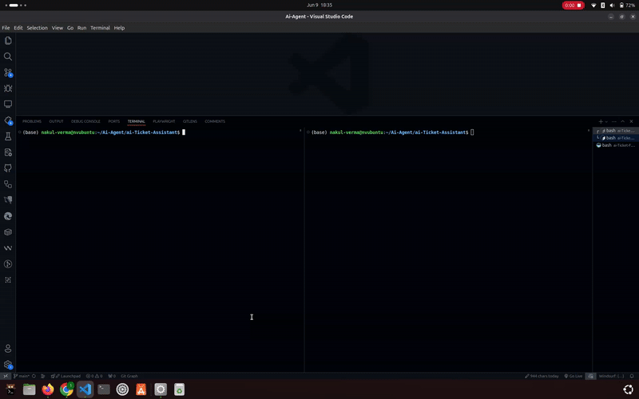

# Ai Agent

<div align="center">
  
</div>

*Ai Agent is a powerful ticket management system enhanced with AI capabilities. It allows users to create, assign, and manage tickets efficiently while leveraging AI to analyze ticket content, suggest priorities, and provide helpful notes. The system also includes role-based access control for admins, moderators, and users.*

---

## Features

- **AI-Powered Ticket Management**:
  - Automatically analyze ticket content using AI.
  - Suggest priorities and provide helpful notes for tickets.
  - Assign tickets to moderators or admins based on related skills.

- **Role-Based Access Control**:
  - Admins can manage users and tickets.
  - Moderators can handle assigned tickets.
  - Users can create and manage their own tickets.

- **Email Notifications**:
  - Notify users and moderators about ticket updates via email.

- **User Profile Management**:
  - Users can view and update their profile information.

- **Search and Filter**:
  - Search for tickets or users based on keywords and filters.

---

## Environment Configuration

To set up the environment variables for the project, follow these steps:

### Step 1: Locate the `.env.sample` File

The `.env.sample` file contains a template for the required environment variables. It is located in the following directories:

- **Frontend**: `ai-Ticket-Frontend/.env.sample`
- **Backend**: `ai-Ticket-Assistant/.env.sample`

### Step 2: Create a `.env` File

1. Copy the `.env.sample` file to a new file named `.env` in the same directory.

   ```bash
   cp .env.sample .env
   ```

2. Edit the `.env` file and replace the placeholders with your actual values.

   ```bash
   nano .env
   ```

### Step 3: Configure Environment Variables

1. Open the `.env` file and replace the placeholders with your actual values.

   ```bash
   nano .env
   ```

2. Save the changes.

### Step 4: Verify Environment Variables

1. Open the `.env` file and verify that the environment variables are correctly configured.

   ```bash
   cat .env
   ```

2. If the environment variables are correctly configured, you can proceed to the next step.

### Step 5: Start the Backend

1. Navigate to the root directory of the project.

   ```bash
   cd ai-Ticket-Assistant
   ```

2. Run the `npm run dev` command to start the application.

   ```bash
   npm run dev
   ```

3. Once the backend is running, you can proceed to the next step.

### Step 6: Start the Frontend

1. Navigate to the root directory of the project.

   ```bash
   cd ai-Ticket-Frontend
   ```

2. Run the `npm run dev` command to start the application.

   ```bash
   npm run dev
   ```

3. Once the frontend is running, you can access it on `http://localhost:5173`.

### ScreenRecord



---

## Contributors

We warmly welcome and appreciate all the amazing contributors who have helped make **AI Agent** better! 🎉

<!-- A big thank you to everyone who has contributed their time, effort, and expertise to this project. Your contributions—whether through code, design, testing, documentation, or feedback—are what make this project thrive. -->

### Want to Contribute?

We’d love to have you onboard! Check out our [Contributing Guidelines](./Contributing.md) to get started. Feel free to submit a pull request or open an issue. Let’s build something amazing together! 🚀
